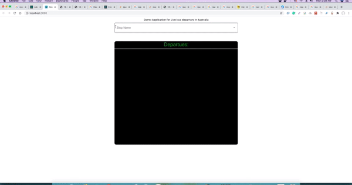

# live_bus_departure_demo

A live bus departure demo with spring boot as backend and ReactJs as frontend

# Backend : Spring-boot api

with docker and docker-compose files
arranged best to be deployed in amazon ECS with AWS Fargate

# frontend :ReactJs

consumes the apis from backend and shows a simple bus departure bord like in the gif above
